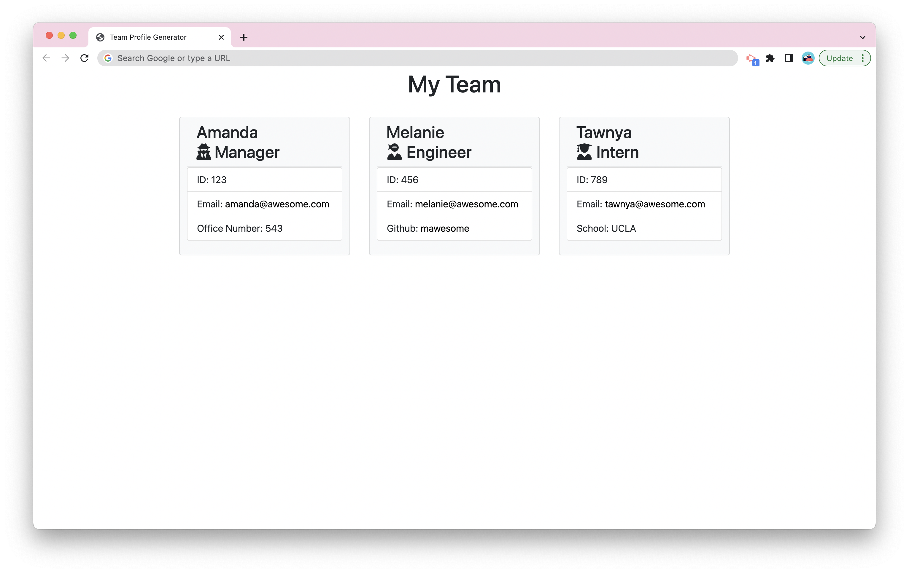

# Team Profile Generator

  
  
    
  
  ## Description

  Team Profile Generator is a command line application that uses Node.js to  take in user input, and dynamically generates an HTML page with your team information. Technologies used include HTML, CSS, Javascript, Bootstrap, FontAwesome, Node.js, and NPM Packages Jest and Inquirer.  
   
    
   

  ## Table of Contents

  - [Installation](#installation)
  - [Usage](#usage)
  - [License](#license)
  - [Tests](#tests)
  - [Questions](#questions)  
   

  ## Installation

  Use the following command to download dependencies for the project:  
  ~~~
  npm install
  ~~~
   

  ## Usage

  From the root menu, call node index.js from the command line. Follow and answer the prompts. A index.html file and a copy of the style.css file will be generated in the 'dist' folder.  
   
  [Example Video](https://drive.google.com/file/d/1xgtguZBFNt3xr4Sbb17R-RwtLaVx2h-X/view).
   

## License 

  This project is licensed under the [MIT License](https://choosealicense.com/licenses/mit/).  
   
  

  ## Tests

  Using the following command to run tests:  
  ~~~
  npm run test
  ~~~
   

  ## Questions

  [GitHub](https://github.com/dneflas)  

